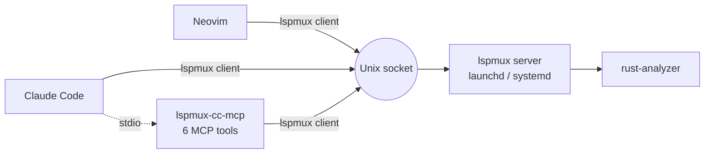

# lspmux-cc

Share a single rust-analyzer instance across Neovim, Claude Code, and Codex in the same Rust workspace. Built on [lspmux](https://codeberg.org/p2502/lspmux) by p2502.

## How It Works

lspmux multiplexes multiple LSP client connections through a Unix socket to one rust-analyzer process. lspmux-cc adds an MCP server that exposes rust-analyzer capabilities as agent-callable tools, plus a Claude Code plugin for transparent LSP routing.



## Install

### Prerequisites

- macOS or Linux
- Rust toolchain (cargo)
- curl, jq

### Core Setup

```sh
git clone <repo-url> && cd lspmux-cc
cargo install --path mcp-server
./setup core
```

`./setup core` installs lspmux, validates rust-analyzer is on PATH (or `RUST_ANALYZER_PATH`), writes the config, and deploys the launchd service.

For Nix users: `nix build` builds everything from the flake.

### Verify

```sh
./setup doctor
```

## MCP Tools

| Tool | Description | Parameters |
|------|-------------|------------|
| `rust_diagnostics` | Compiler errors and warnings for a file | `file_path` |
| `rust_hover` | Type signature and docs at a position | `file_path`, `line`, `character` |
| `rust_goto_definition` | Jump to where a symbol is defined | `file_path`, `line`, `character` |
| `rust_find_references` | All references to a symbol | `file_path`, `line`, `character` |
| `rust_workspace_symbol` | Search symbols by name across the workspace | `query` |
| `rust_server_status` | Server health and workspace info | (none) |

**Coordinates:** `line` and `character` inputs are zero-based (first line = 0). Output locations are one-based. Subtract 1 from output values before passing them as input to another tool.

All file paths must be absolute.

## Host Integrations

### Claude Code

```sh
./setup core
./setup sandbox claude-code
claude plugin add-marketplace /absolute/path/to/lspmux-cc
claude plugin disable rust-analyzer-lsp --scope user
claude plugin install lspmux-rust-cc --scope user
```

`./setup core` starts the shared service outside the sandbox. Claude Code's macOS seatbelt sandbox blocks Unix socket `connect()` by default, so `./setup sandbox claude-code` adds the socket path to `allowUnixSockets` in `~/.claude/settings.json`. Without this, both MCP and LSP connections fail silently.

The plugin registers both an LSP server (for Claude's native Rust support) and an MCP server (for agent tool access). See `docs/hosts/claude-code.md` for the full connection story, troubleshooting, and subagent behavior.

### Codex

```sh
./setup host codex
```

Prints environment variables and launch command. See `docs/hosts/codex.md`.

### Generic MCP

```sh
./setup host generic-mcp
```

Works with any MCP-capable host. See `docs/hosts/generic-mcp.md`.

## Configuration

| Variable | Default | Description |
|----------|---------|-------------|
| `WORKSPACE_ROOT` | current directory | Absolute path to the workspace root |
| `LSPMUX_BOOTSTRAP` | `auto` | `auto` reuses shared service or starts one; `require` fails if unavailable; `off` skips |
| `LSPMUX_PATH` | found via PATH or `$CARGO_HOME/bin` | Path to the lspmux binary |
| `RUST_ANALYZER_PATH` | found via PATH or managed install | Path to the rust-analyzer binary |
| `LSPMUX_CONFIG_PATH` | platform default | macOS: `~/Library/Application Support/lspmux/config.toml`; Linux: `$XDG_CONFIG_HOME/lspmux/config.toml` |
| `LSPMUX_CONNECT` | config `connect` value | Explicit lspmux client endpoint override. Accepts Unix socket paths, `host:port`, or `tcp://host:port`. |
| `LSPMUX_SOCKET_PATH` | `$XDG_RUNTIME_DIR/lspmux/lspmux.sock` | Legacy endpoint override. Still accepted for compatibility, but `LSPMUX_CONNECT` is preferred. |

## Project Layout

```
config/                       # lspmux.toml template
docs/                         # host integration guides, brainstorms
launchd/                      # macOS service definitions
mcp-server/                   # Rust MCP server (the main binary)
  src/
    main.rs                   # entry point
    bootstrap.rs              # runtime config, service discovery
    lsp_client.rs             # LSP JSON-RPC client
    tools.rs                  # MCP tool definitions
  tests/
    integration.rs            # multi-client sharing test
bin/                          # wrapper scripts (lspmux, lspmux-cc-mcp, rust-analyzer)
hooks/                        # session-start, post-file-edit
skills/                       # tool documentation & diagnostics
.claude-plugin/               # plugin manifest + marketplace metadata
.mcp.json                     # MCP server config
.lsp.json                     # LSP server config
setup                         # installation script
systemd/                      # Linux service definitions
todos/                        # tracked issues and roadmap
```

## Development

```sh
just check       # cargo check
just build       # cargo build
just clippy      # pedantic + nursery lints
just fmt         # cargo fmt
just test        # cargo test
just shellcheck  # lint shell scripts
just pre-push    # check + clippy + fmt-check + test
```

```sh
nix flake check  # clippy + fmt + tests via Nix
nix build        # build mcp-server binary
nix develop      # enter devShell
```

## License

MIT
