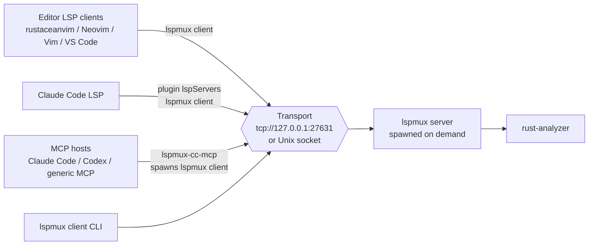

# lspmux-cc

Share one `rust-analyzer` instance across editors, Claude Code, Codex, and other MCP-capable agents in the same Rust workspace. Built on [lspmux](https://codeberg.org/p2502/lspmux) by p2502.

## How It Works

`lspmux` multiplexes multiple LSP client connections to one `rust-analyzer` process. `lspmux-cc` adds an MCP server that exposes rust-analyzer capabilities as agent-callable tools, plus a Claude Code plugin for transparent LSP routing.

The transport is configurable. TCP loopback is the easiest sandbox-friendly path for agent hosts; Unix sockets remain supported when the host can connect to the socket.


```mermaid
graph LR
    NV[Editor LSP clients<br/>rustaceanvim / Neovim / Vim / VS Code] -->|lspmux client| EP
    CC[Claude Code LSP] -->|plugin lspServers<br/>lspmux client| EP
    MCP[MCP hosts<br/>Claude Code / Codex / generic MCP] -->|lspmux-cc-mcp<br/>spawns lspmux client| EP
    CLI[lspmux client CLI] --> EP
    EP{{Transport<br/>tcp://127.0.0.1:27631<br/>or Unix socket}}
    EP --> S[lspmux server<br/>spawned on demand]
    S --> RA[rust-analyzer]
```

## Install

### Prerequisites

- macOS or Linux
- Rust toolchain (`cargo`) for the manual path
- `jq`
- `rust-analyzer` available on `PATH`, via `RUST_ANALYZER_PATH`, or from the flake package

### Install Matrix

| Path | Command | What it gives you |
|------|---------|-------------------|
| Cargo/manual | `cargo install --path mcp-server` | Installs `lspmux-cc-mcp` from this checkout. |
| Cargo/manual | `./setup core` | Installs or finds `lspmux`, validates `rust-analyzer`, writes the lspmux config, and leaves the daemon to be spawned on demand. |
| Cargo/manual | `./setup doctor` | Verifies local binaries, config, legacy service state, and Claude Code sandbox hints. |
| Nix flake | `nix build` | Builds the default `lspmux-cc-mcp` package. |
| Nix flake | `nix build .#plugin` | Builds the assembled Claude Code plugin with bundled wrappers and pinned binaries. |
| Nix flake | `nix build .#rust-analyzer-nightly` | Builds the pinned rust-analyzer package exported by the flake. |
| Nix flake | `nix develop` | Enters a shell with `lspmux`, rust-analyzer, cargo, `just`, `jq`, and shell tooling. |
| Nix flake | `nix flake check` | Runs the flake checks, including Rust checks, formatting, tests, and plugin structure checks. |

`./setup core` does not install or start a launchd/systemd service. Users upgrading from a pre-M5 install should run `./setup migrate` to remove the legacy unit. See [docs/migration-m5.md](docs/migration-m5.md).

### Transport

For sandboxed hosts, prefer TCP loopback:

```toml
listen = "tcp://127.0.0.1:27631"
connect = "tcp://127.0.0.1:27631"
```

Then export:

```sh
export LSPMUX_CONNECT=tcp://127.0.0.1:27631
```

Unix sockets are still supported and are the default generated by `./setup core`. They are a good fit for unsandboxed editor clients or hosts that can allowlist the exact socket path.

## MCP Tools

All tools are read-only: they return data and never modify your files. The edits from `rust_code_actions` and `rust_rename` are returned for you or the agent to apply.

| Tool | Description | Parameters |
|------|-------------|------------|
| `rust_diagnostics` | Compiler errors and warnings for a file | `file_path` |
| `rust_hover` | Type signature and docs at a position | `file_path`, `line`, `character` |
| `rust_goto_definition` | Jump to where a symbol is defined | `file_path`, `line`, `character` |
| `rust_goto_implementation` | Implementations of a trait or trait method | `file_path`, `line`, `character` |
| `rust_find_references` | All references to a symbol | `file_path`, `line`, `character` |
| `rust_workspace_symbol` | Search symbols by name across the workspace | `query` |
| `rust_document_symbols` | A file's hierarchical symbol tree | `file_path` |
| `rust_code_actions` | Quick fixes / refactors for a range, with their edits (unapplied) | `file_path`, `start_line`, `start_character`, `end_line`, `end_character` |
| `rust_rename` | The workspace edit to rename a symbol (unapplied) | `file_path`, `line`, `character`, `new_name` |
| `rust_call_hierarchy_incoming` | Callers of the symbol at a position | `file_path`, `line`, `character` |
| `rust_call_hierarchy_outgoing` | Functions called by the symbol at a position | `file_path`, `line`, `character` |
| `rust_expand_macro` | Expand the macro invocation at a position | `file_path`, `line`, `character` |
| `rust_server_status` | Server health, readiness, and workspace info | (none) |
| `rust_workspace_registry` | All rust-analyzer instances the daemon is hosting | (none) |

**Coordinates:** `line` and `character` inputs are zero-based (first line = 0). Output locations are one-based. Subtract 1 from output values before passing them as input to another tool.

All file paths must be absolute.

## Host and Editor Integrations

Start with [docs/hosts/README.md](docs/hosts/README.md) for the comparison table.

| Guide | Use this when |
|-------|---------------|
| [Claude Code](docs/hosts/claude-code.md) | You want both Claude Code LSP routing and MCP tools. |
| [Codex](docs/hosts/codex.md) | You want MCP tools in Codex. |
| [Generic MCP](docs/hosts/generic-mcp.md) | You want to wire `lspmux-cc-mcp` into another MCP host. |
| [rustaceanvim](docs/hosts/rustaceanvim.md) | You use rustaceanvim's built-in lspmux support. |
| [Neovim LSP](docs/hosts/neovim.md) | You use Neovim's built-in LSP client or `nvim-lspconfig`. |
| [Vim/vim-lsp](docs/hosts/vim-lsp.md) | You use Vim 8 with `prabirshrestha/vim-lsp`. |
| [VS Code](docs/hosts/vscode.md) | You use the VS Code rust-analyzer extension. |

## Configuration

| Variable | Default | Description |
|----------|---------|-------------|
| `WORKSPACE_ROOT` | current directory | Absolute path to the workspace root |
| `LSPMUX_BOOTSTRAP` | `auto` | `auto` reuses an available daemon or starts one on demand; `require` fails if unavailable; `off` skips bootstrap |
| `LSPMUX_PATH` | found via PATH or `$CARGO_HOME/bin` | Path to the lspmux binary |
| `LSPMUX_MCP_PATH` | found via PATH, `$CARGO_HOME/bin`, or `result/bin` | Path to the `lspmux-cc-mcp` binary |
| `RUST_ANALYZER_PATH` | found via PATH or managed install | Path to the rust-analyzer binary |
| `LSPMUX_CONFIG_PATH` | platform default | macOS: `~/Library/Application Support/lspmux/config.toml`; Linux: `$XDG_CONFIG_HOME/lspmux/config.toml` |
| `LSPMUX_CONNECT` | config `connect` value | Explicit lspmux client endpoint override. Accepts Unix socket paths, `host:port`, or `tcp://host:port`. |
| `LSPMUX_SOCKET_PATH` | `$XDG_RUNTIME_DIR/lspmux/lspmux.sock` | Legacy endpoint override. Still accepted for compatibility, but `LSPMUX_CONNECT` is preferred. |

`LSPMUX_PATH`, `LSPMUX_MCP_PATH`, and `RUST_ANALYZER_PATH` sit at the top of their lookup cascades, so a stale export shadows an installed or bundled binary. See [docs/binary-resolution.md](docs/binary-resolution.md) for the full resolution order of each binary.

## Project Layout

```
config/                       # lspmux.toml template
docs/                         # host integration guides, brainstorms
launchd/                      # legacy macOS service template
mcp-server/                   # Rust MCP server (the main binary)
  src/
    main.rs                   # entry point
    bootstrap.rs              # runtime config, service discovery
    lsp_client.rs             # LSP JSON-RPC client
    tools.rs                  # MCP tool definitions
  tests/
    integration.rs            # multi-client sharing test
bin/                          # wrapper scripts (lspmux, lspmux-cc-mcp, rust-analyzer)
hooks/                        # session-start, post-file-edit
skills/                       # tool documentation & diagnostics
.claude-plugin/               # plugin manifest + marketplace metadata
.mcp.json                     # MCP server config
.lsp.json                     # LSP server config
setup                         # installation script
systemd/                      # legacy Linux service template
todos/                        # tracked issues and roadmap
```

## Development

```sh
just check       # cargo check
just build       # cargo build
just clippy      # pedantic + nursery lints
just fmt         # cargo fmt
just test        # cargo test
just shellcheck  # lint shell scripts
just pre-push    # check + clippy + fmt-check + test
```

```sh
nix flake check  # clippy + fmt + tests via Nix
nix build        # build mcp-server binary
nix develop      # enter devShell
```

## License

MIT
