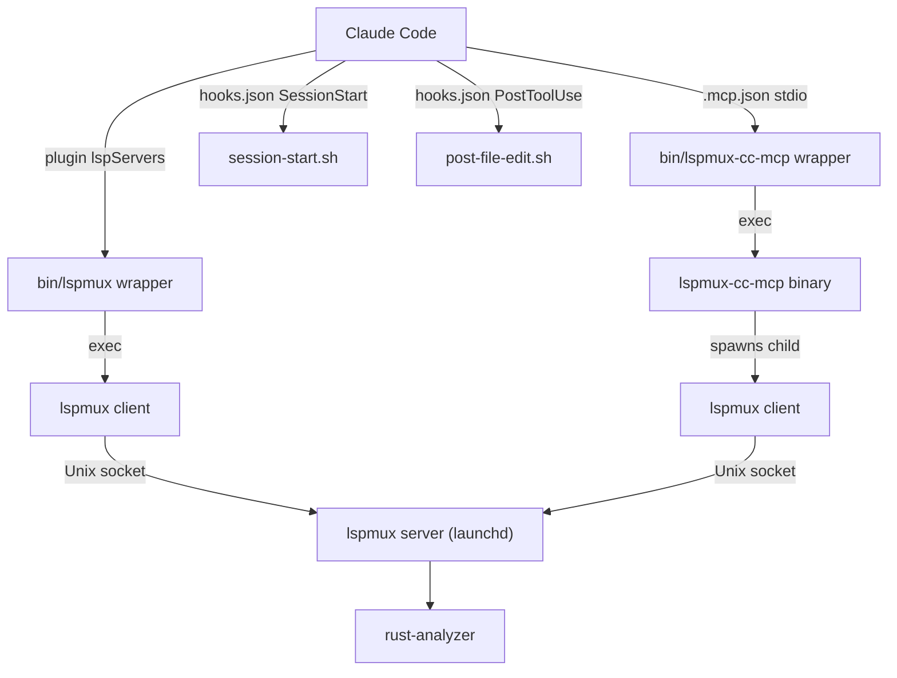

# Claude Code Integration

## 1. Overview

`lspmux-cc` pipes a shared `rust-analyzer` instance into Claude Code through two channels: LSP (native Rust language support) and MCP (agent tools like diagnostics, hover, and go-to-definition). Both channels run as sandboxed child processes spawned by Claude Code itself.

## 2. Prerequisites

Run `./setup core` **before** installing the Claude Code plugin. The setup script installs `lspmux` if needed, validates that `rust-analyzer` is already available via `RUST_ANALYZER_PATH` or `PATH`, writes the config, and registers the launchd (macOS) or systemd (Linux) service.

The launchd/systemd service **must already be running** when Claude Code starts. Claude Code's sandbox blocks child processes from calling `launchctl bootstrap` or `systemctl --user start`, so the MCP server can't start the service on your behalf if it isn't already up.

Required tools on `$PATH`:

- `jq` (hook JSON output)
- `cargo` (lspmux install, MCP server build)
- `rust-analyzer` unless you launch Claude from an environment that sets `RUST_ANALYZER_PATH`

Verify everything with `./setup doctor`. It checks binaries, config, socket, and service unit presence.

## 3. Sandbox Configuration

This is the single most common failure point. Get it right first.

Claude Code on macOS runs inside a seatbelt sandbox that blocks `connect()` on Unix domain sockets by default. The lspmux server listens on a Unix socket, so Claude Code's LSP and MCP child processes can't reach it unless you explicitly allowlist the socket path.

### Allowlisting the socket

Add the socket path to `allowUnixSockets` in `~/.claude/settings.json`:

```json
{
  "sandbox": {
    "network": {
      "allowUnixSockets": ["$TMPDIR/lspmux/lspmux.sock"]
    }
  }
}
```

**Replace `$TMPDIR` with the actual resolved path.** The shell variable won't expand inside JSON. Run `echo $TMPDIR` to find it; on macOS it's typically something like `/var/folders/xx/yyyyyy/T/`.

So the real entry looks like:

```json
{
  "sandbox": {
    "network": {
      "allowUnixSockets": ["/var/folders/xx/yyyyyy/T/lspmux/lspmux.sock"]
    }
  }
}
```

`./setup doctor` prints the resolved socket path. Copy it directly.

### Platform socket paths

| Platform | Default socket path |
|----------|-------------------|
| macOS | `$TMPDIR/lspmux/lspmux.sock` |
| Linux | `$XDG_RUNTIME_DIR/lspmux/lspmux.sock` |

### Automated patching

```bash
./setup sandbox claude-code
```

This reads your current `~/.claude/settings.json`, splices in the resolved socket path, and writes it back. Safe to run multiple times.

### TCP fallback (reduced security)

If you can't get Unix sockets working, you can switch lspmux to TCP. Set `listen` in your lspmux config (`~/Library/Application Support/lspmux/config.toml` on macOS):

```toml
listen = "tcp://127.0.0.1:27631"
connect = "tcp://127.0.0.1:27631"
```

**Warning:** TCP localhost has no authentication. Any local process can connect and issue LSP requests against your workspace. This includes other users on shared machines, malicious browser extensions with localhost access, and anything else running under your login. Use Unix sockets whenever possible.

### Don't use `allowAllUnixSockets`

Setting `allowAllUnixSockets: true` in your sandbox config blows the doors off every Unix socket on your machine. That includes Docker's control socket (`/var/run/docker.sock`), your SSH agent (`$SSH_AUTH_SOCK`), the GPG agent, and any other socket-based service. Don't do this. Allowlist only the lspmux socket.

## 4. Install

Three commands. Run them in this order:

```bash
claude plugin add-marketplace /absolute/path/to/lspmux-cc
claude plugin disable rust-analyzer-lsp --scope user
claude plugin install lspmux-rust-cc --scope user
```

What each does:

1. **`add-marketplace`** registers the `lspmux-cc` directory as a local marketplace source. Claude Code scans it for plugin manifests, hook definitions, and MCP server entries.

2. **`disable rust-analyzer-lsp`** turns off Claude Code's built-in rust-analyzer plugin (shipped by Anthropic). You need this off because lspmux replaces it with a shared, multiplexed instance. Running both produces duplicate diagnostics and non-deterministic behavior.

3. **`install lspmux-rust-cc`** activates the lspmux plugin, which registers the LSP server wrapper, MCP server wrapper, hooks, and skills.

`--scope user` applies across all projects. Use `--scope project` if you only want lspmux for a specific workspace.

## 5. How the Connection Works



The plugin wires up four integration points:

**LSP channel.** The `bin/lspmux` wrapper finds the lspmux binary (checking `LSPMUX_PATH`, then `$PATH`, then `$CARGO_HOME/bin/lspmux`), stamps the client identity (`LSPMUX_CLIENT_KIND=claude_lsp`), and `exec`s into `lspmux client`. The client connects to the shared server over the Unix socket and speaks LSP stdio back to Claude Code.

**MCP channel.** The `bin/lspmux-cc-mcp` wrapper locates the `lspmux-cc-mcp` Rust binary, stamps `LSPMUX_CLIENT_KIND=claude_mcp`, and `exec`s it. The MCP server bootstraps its own lspmux client connection internally and exposes 6 tools over MCP stdio.

**SessionStart hook.** `session-start.sh` runs at session startup. It checks whether the shared lspmux service is already running and injects a `systemMessage` into the conversation with status info. It doesn't start or manage services; that's the MCP server's job.

**PostToolUse hook.** `post-file-edit.sh` fires after every `Write` or `Edit` tool use. It parses the tool input JSON, and if the edited file is Rust-related (`.rs`, `Cargo.toml`, `Cargo.lock`), calls `lspmux sync` to notify the server about the change.

## 6. Overriding Built-in rust-analyzer

Claude Code ships with `rust-analyzer-lsp`, an Anthropic-maintained marketplace plugin that runs its own rust-analyzer process. You need to disable it when using lspmux.

```bash
claude plugin disable rust-analyzer-lsp --scope user
```

Verify it's off:

```bash
claude plugin list
```

The `rust-analyzer-lsp` entry should show as disabled. The `lspmux-rust-cc` entry should show as installed and active.

If both plugins are active simultaneously, you'll get duplicate diagnostics, conflicting hover responses, and race conditions on file synchronization. The behavior is non-deterministic and confusing.

To revert back to the built-in:

```bash
claude plugin enable rust-analyzer-lsp --scope user
claude plugin disable lspmux-rust-cc --scope user
```

## 7. Verification

Three layers, from outside Claude Code to inside it.

### Before Claude Code

```bash
./setup doctor
```

This checks:
- lspmux binary exists and is executable
- rust-analyzer is available via `RUST_ANALYZER_PATH` or `PATH`
- Config file is present
- Unix socket exists and is connectable
- launchd/systemd unit is installed

If any check fails, fix it before launching Claude Code.

### Inside a Claude Code session

Call the `rust_server_status` MCP tool. Look for these fields in the response:

- `server_status`: should be `"running"`
- `runtime.service_mode`: should be `"reused"` (meaning it connected to the existing launchd/systemd service)
- `workspace_root`: should match your project directory
- `readiness.health`: should be `"ok"` once indexing completes

If `service_mode` shows `"started_directly"`, the MCP server couldn't find the launchd service and fell back to spawning lspmux itself. That works, but it means your service setup is broken.

### LSP verification

Claude Code writes debug logs to `~/.claude/debug/latest`. Check for LSP initialization messages from the lspmux wrapper. Errors in socket connection will show up here before they surface as missing diagnostics.

## 8. Agent and Subagent Usage

Subagents inherit their parent's MCP connection. They don't spawn a new MCP process or open a new socket, so there's no extra bootstrap cost.

Subagents do **not** trigger `SessionStart` hooks. If the parent's bootstrap failed, subagents get zero MCP tools with no error message. The only diagnostic context they have is the `systemMessage` from the parent's `session-start.sh`, which lives in the conversation history.

All 6 MCP tools are available to subagents by default:

- `rust_diagnostics`: errors and warnings for a file
- `rust_hover`: type signature and docs at a position
- `rust_goto_definition`: find where a symbol is defined
- `rust_find_references`: find all references to a symbol
- `rust_workspace_symbol`: search symbols by name across the workspace
- `rust_server_status`: server health, bootstrap metadata, telemetry

You can restrict tools via `disallowedTools` in Claude Code's configuration if needed.

## 9. Troubleshooting

| Symptom | Cause | Fix |
|---------|-------|-----|
| MCP tools not listed | Plugin not installed or not active | Run `claude plugin list`, verify `lspmux-rust-cc` is installed. Re-run install commands from section 4. |
| Socket exists but `connect()` fails | Stale socket file from a crashed server | Delete the socket file (`rm $TMPDIR/lspmux/lspmux.sock`), then restart the launchd service: `launchctl kickstart gui/$(id -u)/com.lspmux.server` |
| `rust_server_status` returns "stopped" | lspmux-cc-mcp binary can't reach the server | Check `./setup doctor`. Verify the socket path in lspmux config matches what the MCP binary expects. Check `allowUnixSockets` in sandbox config. |
| "service is unavailable" error | `LSPMUX_BOOTSTRAP=require` set but service isn't running | Run `./setup core` to install and start the service, or switch to `LSPMUX_BOOTSTRAP=auto` to allow direct fallback. |
| Sandbox blocks socket connection | `allowUnixSockets` missing or wrong path | Run `./setup doctor` to get the resolved socket path. Add it to `~/.claude/settings.json` per section 3. Run `./setup sandbox claude-code` for automated patching. |
| rust-analyzer indexing slow | Large workspace, first connection, or cold cache | Wait for indexing to complete. Call `rust_server_status` periodically; `readiness.health` flips to `"ok"` when done. Subsequent sessions reuse the warm cache. |
| Duplicate diagnostics | Both `rust-analyzer-lsp` and `lspmux-rust-cc` active | Disable the built-in: `claude plugin disable rust-analyzer-lsp --scope user` |
| Plugin not listed after install | Marketplace path wrong or not absolute | Re-run `claude plugin add-marketplace /absolute/path/to/lspmux-cc` with the full path. Relative paths don't work. |
| Hook stderr warnings | `jq` not on PATH or lspmux binary missing | Install `jq`. Run `./setup core` to install lspmux. Hook diagnostics go to stderr and don't affect MCP correctness. |
| Tools return errors after file edit | File sync didn't fire | The `post-file-edit.sh` hook triggers on `Write`/`Edit` for `.rs`, `Cargo.toml`, and `Cargo.lock` files. If you edited a file through another tool, call `rust_diagnostics` on it to force a re-read. The MCP server rereads files from disk before each request. |

## 10. Environment Variables

| Variable | Default | Description |
|----------|---------|-------------|
| `WORKSPACE_ROOT` | Current working directory | Absolute path to the project root. The MCP server uses this for rust-analyzer workspace initialization. Auto-set by Claude Code's process environment. |
| `LSPMUX_BOOTSTRAP` | `auto` | Bootstrap policy. `auto`: reuse service if available, fall back to direct spawn. `require`: fail if no service running. `off`: skip service bootstrap entirely. Overridable. |
| `LSPMUX_PATH` | `lspmux` on `$PATH`, then `$CARGO_HOME/bin/lspmux` | Path to the lspmux binary. Overridable. |
| `RUST_ANALYZER_PATH` | unset | Preferred explicit path to the rust-analyzer binary. If unset, the wrappers fall back to `rust-analyzer` on `$PATH`. |
| `LSPMUX_CONFIG_PATH` | `~/Library/Application Support/lspmux/config.toml` (macOS), `$XDG_CONFIG_HOME/lspmux/config.toml` (Linux) | Path to the lspmux TOML config file. Overridable. |
| `LSPMUX_SOCKET_PATH` | `$TMPDIR/lspmux/lspmux.sock` (macOS), `$XDG_RUNTIME_DIR/lspmux/lspmux.sock` (Linux) | Unix socket path for client-server communication. Overridable. Must match the `listen` value in lspmux config. |
| `LSPMUX_CLIENT_KIND` | `claude_mcp` (MCP wrapper), `claude_lsp` (LSP wrapper) | Identifies the client type in telemetry and logs. Auto-set by the bin wrappers. |
| `LSPMUX_CLIENT_HOST` | `claude` | Identifies the host application. Auto-set by the bin wrappers. |
| `LSPMUX_SESSION_ID` | `claude-mcp-$$-$(date +%s)` or `claude-lsp-$$-$(date +%s)` | Unique session identifier for telemetry correlation. Auto-generated from PID and timestamp if not set. |
