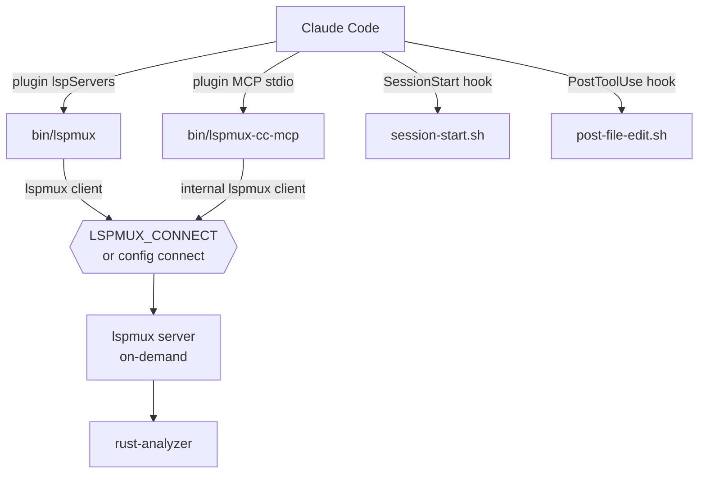

# Claude Code Integration

Claude Code uses `lspmux-cc` through both LSP and MCP:

- LSP: the plugin registers `bin/lspmux`, which execs `lspmux client --server-path ...` for Claude Code's native Rust language support.
- MCP: the plugin registers `bin/lspmux-cc-mcp`, which exposes the Rust tools and internally connects through `lspmux client`.

## Install

Manual checkout:

```sh
./setup core
./setup sandbox claude-code
claude plugin add-marketplace /absolute/path/to/lspmux-cc
claude plugin disable rust-analyzer-lsp --scope user
claude plugin install lspmux-rust-cc --scope user
```

Nix-built plugin:

```sh
nix build .#plugin
claude plugin add-marketplace "$(pwd)/result"
claude plugin disable rust-analyzer-lsp --scope user
claude plugin install lspmux-rust-cc --scope user
```

`./setup core` installs or finds `lspmux`, validates `rust-analyzer`, and writes the lspmux config. It does not install a launchd/systemd service. The MCP server starts `lspmux server` on demand when no reachable daemon is already present.

## Transport

### TCP Loopback

TCP loopback is the simplest Claude Code sandbox path because it avoids Unix socket allowlisting:

```toml
listen = "tcp://127.0.0.1:27631"
connect = "tcp://127.0.0.1:27631"
```

Set the endpoint for both LSP and MCP children:

```sh
export LSPMUX_CONNECT=tcp://127.0.0.1:27631
```

TCP localhost has no lspmux-level authentication. Use it for local single-user workstations where sandbox compatibility matters.

### Unix Socket

Unix sockets remain supported. Claude Code's macOS sandbox blocks Unix socket `connect()` by default, so the exact socket path must be allowlisted:

```sh
./setup sandbox claude-code
```

That command adds the resolved socket path to `sandbox.network.allowUnixSockets` in `~/.claude/settings.json`. Avoid `allowAllUnixSockets`; it grants access to unrelated local daemon sockets.

## Runtime Contract

The plugin supplies these defaults:

| Variable | Purpose |
|----------|---------|
| `LSPMUX_BOOTSTRAP=auto` | Reuse a reachable daemon or spawn one on demand. |
| `LSPMUX_CONFIG_PATH` | Points `lspmux` and the MCP server at the generated config. |
| `LSPMUX_CONNECT` | Optional endpoint override, especially for TCP mode. |
| `LSPMUX_CLIENT_KIND` | `claude_lsp` for LSP, `claude_mcp` for MCP telemetry. |
| `LSPMUX_CLIENT_HOST=claude` | Identifies Claude Code in telemetry. |

For Nix installs, the `.#plugin` output includes symlinks to `lspmux`, `lspmux-cc-mcp`, and a `rust-analyzer` wrapper that resolves the pinned `.#rust-analyzer-nightly` package unless `RUST_ANALYZER_PATH` overrides it.

## Connection Flow


```mermaid
graph TD
    CC[Claude Code] -->|plugin lspServers| LSP["bin/lspmux"]
    CC -->|plugin MCP stdio| MCP["bin/lspmux-cc-mcp"]
    CC -->|SessionStart hook| HOOK[session-start.sh]
    CC -->|PostToolUse hook| EDIT[post-file-edit.sh]
    LSP -->|lspmux client| EP{{LSPMUX_CONNECT<br/>or config connect}}
    MCP -->|internal lspmux client| EP
    EP --> SRV["lspmux server<br/>on-demand"]
    SRV --> RA[rust-analyzer]
```

The SessionStart hook reports status. The PostToolUse hook syncs Rust-related edits after Claude Code write/edit operations.

## Verification

Run outside Claude Code:

```sh
./setup doctor
```

Inside Claude Code, call the MCP tool:

```text
rust_server_status
```

Healthy signals:

- `server_status` is `running`
- `readiness.health` becomes `ok` after indexing
- `workspace_root` matches the project
- `legacy_global_daemon_detected` is false unless you intentionally kept the legacy service-manager path

For LSP verification, inspect Claude Code's debug logs for the `lspmux` wrapper and `rust-analyzer` initialization.

## Troubleshooting

| Symptom | Cause | Fix |
|---------|-------|-----|
| MCP tools not listed | Plugin not installed or not active | Run `claude plugin list`, then repeat the install commands. |
| Built-in and lspmux diagnostics both appear | `rust-analyzer-lsp` is still enabled | `claude plugin disable rust-analyzer-lsp --scope user` |
| Unix socket connection fails | Socket path is not allowlisted | Run `./setup sandbox claude-code` or switch to TCP loopback. |
| TCP connection fails | `LSPMUX_CONNECT` does not match lspmux config | Set both config `listen`/`connect` and env to `tcp://127.0.0.1:27631`. |
| `rust_server_status` reports unavailable | Bootstrap cannot reach or start lspmux | Verify `LSPMUX_PATH`, `LSPMUX_CONFIG_PATH`, and `LSPMUX_CONNECT`; run `./setup doctor`. |
| Legacy daemon detected | Pre-M5 launchd/systemd unit is still loaded | Run `./setup migrate`, unless you intentionally use the escape hatch in [migration-m5](../migration-m5.md). |
| Hook warnings mention `jq` | Hook JSON processing dependency missing | Install `jq` or use `nix build .#plugin`, which injects the Nix `jq` path into hook scripts. |
