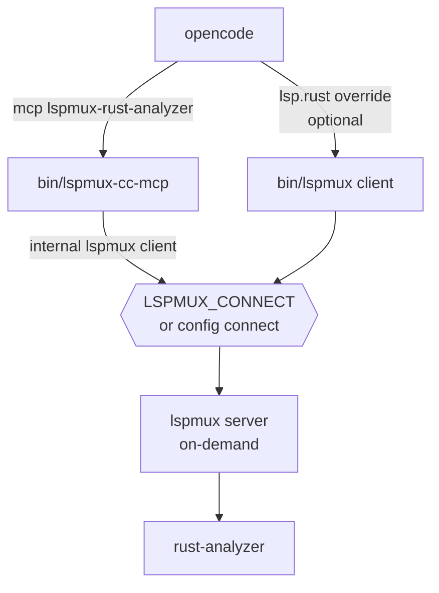

# opencode Integration

[opencode](https://opencode.ai) uses `lspmux-cc` through MCP, and optionally through an
LSP override. Both are configured declaratively in `opencode.json`; there is no compiled
plugin to build.

- MCP: registers `bin/lspmux-cc-mcp`, which exposes the `rust_*` tools and connects
  internally through `lspmux client`.
- LSP (optional): overrides opencode's built-in `rust` server so its native code
  intelligence routes through `bin/lspmux` to the same pooled `rust-analyzer`.

## Config Paths

opencode reads config from (later sources override earlier ones):

- Global: `~/.config/opencode/opencode.json`
- Project: `opencode.json` or `.opencode/` at the project root

opencode resolves the project root by walking up from the current directory to the
nearest Git root. Keep the MCP block (which pins `WORKSPACE_ROOT`) in a *project-scoped*
config, or use the `{env:WORKSPACE_ROOT}` substitution shown below if you prefer a single
global config.

## Install

Manual checkout:

```sh
./setup core
./setup host opencode
```

Nix:

```sh
nix build
nix build .#rust-analyzer-nightly
```

Point the config at the built absolute paths (`result/bin/lspmux-cc-mcp`,
`result/bin/lspmux`) or enter `nix develop` so `lspmux`, `lspmux-cc-mcp`, and
`rust-analyzer` are on `PATH`.

## MCP Only (default-safe)

This wires the `rust_*` agent tools and leaves opencode's own rust-analyzer untouched:

```json
{
  "$schema": "https://opencode.ai/config.json",
  "mcp": {
    "lspmux-rust-analyzer": {
      "type": "local",
      "command": ["/absolute/path/to/lspmux-cc/bin/lspmux-cc-mcp"],
      "enabled": true,
      "environment": {
        "WORKSPACE_ROOT": "/absolute/path/to/workspace",
        "LSPMUX_BOOTSTRAP": "auto",
        "LSPMUX_CONNECT": "tcp://127.0.0.1:27631",
        "RUST_ANALYZER_PATH": "/absolute/path/to/rust-analyzer",
        "LSPMUX_CONFIG_PATH": "/absolute/path/to/lspmux/config.toml",
        "LSPMUX_CLIENT_KIND": "opencode_mcp",
        "LSPMUX_CLIENT_HOST": "opencode"
      }
    }
  }
}
```

For a single global config that follows whichever workspace you launch from, replace the
fixed path with opencode's environment substitution:

```json
"WORKSPACE_ROOT": "{env:WORKSPACE_ROOT}"
```

## MCP + LSP Override

Add an `lsp.rust` entry to also route opencode's native Rust intelligence through the
shared instance:

```json
{
  "$schema": "https://opencode.ai/config.json",
  "mcp": {
    "lspmux-rust-analyzer": {
      "type": "local",
      "command": ["/absolute/path/to/lspmux-cc/bin/lspmux-cc-mcp"],
      "enabled": true,
      "environment": {
        "WORKSPACE_ROOT": "/absolute/path/to/workspace",
        "LSPMUX_BOOTSTRAP": "auto",
        "LSPMUX_CONNECT": "tcp://127.0.0.1:27631",
        "RUST_ANALYZER_PATH": "/absolute/path/to/rust-analyzer",
        "LSPMUX_CONFIG_PATH": "/absolute/path/to/lspmux/config.toml",
        "LSPMUX_CLIENT_KIND": "opencode_mcp",
        "LSPMUX_CLIENT_HOST": "opencode"
      }
    }
  },
  "lsp": {
    "rust": {
      "command": ["/absolute/path/to/lspmux-cc/bin/lspmux", "client", "--server-path", "/absolute/path/to/rust-analyzer"],
      "extensions": [".rs"],
      "env": {
        "LSPMUX_CONNECT": "tcp://127.0.0.1:27631",
        "LSPMUX_CLIENT_KIND": "opencode_lsp",
        "LSPMUX_CLIENT_HOST": "opencode"
      }
    }
  }
}
```

Overriding `lsp.rust` replaces opencode's built-in `rust` entry wholesale. If you depend
on rust-analyzer initialization options, re-supply them through opencode's
`initialization` key on the same entry. If you would rather keep your own rust-analyzer,
stay on the MCP-only config above.

A few things worth knowing about this config:

- MCP entries use the `environment` key; LSP entries use `env`. opencode names them
  differently, and mixing them up silently drops the variables.
- `RUST_ANALYZER_PATH` (MCP `environment`) and `--server-path` (LSP `command`) point at
  the same binary delivered two ways. This mirrors how the Claude Code plugin splits
  `.mcp.json` and `.lsp.json`; both paths need it.
- The LSP entry needs no `WORKSPACE_ROOT`. `lspmux client` forwards opencode's LSP
  `initialize` request, whose `rootUri` opencode sets from the detected project root.
  Only the MCP server initializes rust-analyzer itself, so only it needs `WORKSPACE_ROOT`.

## Runtime Contract

| Variable | Recommended value | Notes |
|----------|-------------------|-------|
| `WORKSPACE_ROOT` | Absolute Rust workspace path | MCP only; used for rust-analyzer initialization. Use `{env:WORKSPACE_ROOT}` in a global config. |
| `LSPMUX_BOOTSTRAP` | `auto` | Reuses a reachable daemon or spawns one on demand. |
| `LSPMUX_CONNECT` | `tcp://127.0.0.1:27631` | Preferred endpoint. Set it on both the MCP `environment` and the LSP `env`. |
| `RUST_ANALYZER_PATH` | Optional absolute path | Use for a pinned Nix rust-analyzer or a custom binary. |
| `LSPMUX_CONFIG_PATH` | Optional config path | Defaults to the platform lspmux config path. |
| `LSPMUX_PATH` | Optional absolute path | Needed only if `lspmux` is not on `PATH`; the wrappers otherwise resolve it from `PATH`, cargo, or the Nix result. |
| `LSPMUX_CLIENT_KIND` | `opencode_mcp` / `opencode_lsp` | Telemetry identity. |
| `LSPMUX_CLIENT_HOST` | `opencode` | Telemetry host. |

This set differs from the Codex contract: opencode invokes the binary through a `command`
array, so there is no `LSPMUX_PATH` requirement, and it uses `LSPMUX_CONNECT` rather than
`LSPMUX_SOCKET_PATH`. `LSPMUX_SOCKET_PATH` is still accepted as a compatibility alias.

## Transport

TCP loopback is the simplest path. Set the lspmux config:

```toml
listen = "tcp://127.0.0.1:27631"
connect = "tcp://127.0.0.1:27631"
```

and match `LSPMUX_CONNECT` in the opencode config. Loopback TCP has no lspmux-level
authentication; use it on local single-user workstations.

Unix sockets also work. Unlike Claude Code, opencode does not run under the macOS sandbox,
so there is no `allowUnixSockets` allowlisting step. Omit `LSPMUX_CONNECT` or set it to the
absolute socket path.

## Connection Flow



## Verification

In an opencode session, call:

```text
rust_server_status
```

Healthy signals:

- `server_status` is `running`
- `workspace_root` is the configured workspace
- `readiness.health` becomes `ok` after indexing

Then run `rust_diagnostics` on an absolute `.rs` file to verify the full MCP-to-LSP path.

With the LSP override enabled, open a `.rs` file and confirm hover and goto-definition
work, and that diagnostics appear once (not duplicated). Run `./setup doctor` outside
opencode for a binary and config sanity check.

## Troubleshooting

| Symptom | Cause | Fix |
|---------|-------|-----|
| MCP tools not listed | Server disabled, or opencode loaded a different config | Confirm `"enabled": true` and that the config opencode loaded is the one you edited. |
| Duplicate diagnostics | Built-in `rust` LSP and the override are both active, or a stale prior `rust` config remains | Ensure `lsp.rust` fully replaces the built-in entry, or drop the override and use the MCP-only config. |
| Wrong-workspace results | A static `WORKSPACE_ROOT` in the global config pins every repo to one workspace | Move the `mcp` block to a project `opencode.json`, or set `WORKSPACE_ROOT` to `{env:WORKSPACE_ROOT}`. |
| `rust_server_status` reports unavailable | Bootstrap cannot reach or start lspmux | Verify `LSPMUX_PATH`, `LSPMUX_CONFIG_PATH`, and `LSPMUX_CONNECT`; run `./setup doctor`. |
| TCP connection fails | `LSPMUX_CONNECT` does not match the lspmux config | Set both config `listen`/`connect` and the env to `tcp://127.0.0.1:27631`. |

## Why opencode.json and not a plugin

opencode also has a JavaScript/TypeScript plugin system, but it targets hooks, events, and
custom tools, and it pulls in a Bun/npm install step. MCP and LSP wiring is fully
declarative in `opencode.json`, so a plugin adds nothing here.
