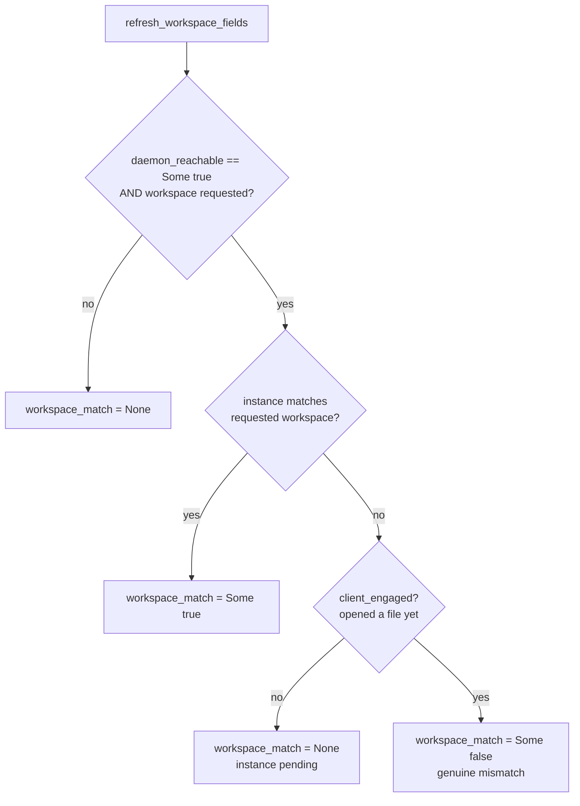

# fix: Stop reporting workspace_match=false at cold start

## Summary

`rust_server_status` reports `workspace_match: Some(false)` immediately after a
session bootstraps the daemon on the `StartedDirectly` path, even though nothing
is wrong. The daemon answers `lspmux status --json`, but no rust-analyzer
instance for this workspace exists yet because this MCP server hasn't opened a
file (hasn't triggered instance spawn). The fix teaches the status computation to
tell "instance not spawned yet" apart from "genuine workspace mismatch" by
consulting a signal the daemon can't provide: whether this server's `LspClient`
has opened any file yet.

---

## Problem Frame

`RuntimeConfig::refresh_workspace_fields` (`mcp-server/src/bootstrap.rs:321`)
computes `workspace_match` purely from the daemon's instance list:

```
(Some(true), Some(_)) => Some(matched_instance.is_some())
```

At cold start the daemon is reachable (`Some(true)`) and a workspace is requested
(`Some(_)`), but `matched_instance` is `None` because the daemon spawns a
per-workspace rust-analyzer instance lazily — only after a client sends an LSP
request for that workspace. This MCP server triggers that spawn through
`LspClient::ensure_file_open` (`mcp-server/src/lsp_client.rs:414`), which fires on
the first `rust_diagnostics`/`rust_hover`/etc. call. A user who inspects
`rust_server_status` before touching any file sees `workspace_match: false` — a
mismatch signal at the exact moment everything is fine.

`server_status` already recomputes the field per call rather than trusting the
bootstrap snapshot (`mcp-server/src/tools.rs:628`, with the explanatory comment at
623-627), so the issue's option 3 ("recompute lazily") shipped. The residual gap
is the cold-start window: a lazy recompute still returns `Some(false)` when no
instance has spawned yet.

The honest answer in that window is "unknown — instance pending," which the
existing tri-state already has a slot for: `None`. The daemon alone can't
distinguish pending-from-mismatch, but the server can: if its own `LspClient`
has never opened a file, it has never asked the daemon to spawn an instance, so a
missing instance is expected, not a mismatch.

---

## Requirements

- **R1.** On the cold-start path (daemon reachable, workspace requested, this
  server has not yet opened a file), `workspace_match` MUST report `None`, not
  `Some(false)`.
- **R2.** A genuine mismatch — this server *has* engaged the daemon (opened ≥1
  file) yet no instance serves the requested workspace — MUST still report
  `Some(false)`.
- **R3.** The warm case (an instance serves the requested workspace) MUST still
  report `Some(true)`, including the `Reused`-daemon case where another client
  already spawned the instance before this server opened anything.
- **R4.** The daemon-down and probe-skipped cases (`daemon_reachable` is
  `Some(false)` or `None`) MUST stay `None`, unchanged.
- **R5.** A consumer reading the status SHOULD be able to tell "instance pending"
  apart from "daemon unreachable" — both surface `workspace_match: None`, so the
  distinction rides on `daemon_reachable` and the human-readable `summary`.

---

## Key Technical Decisions

**KTD1 — Use "client has opened a file" as the pending signal, not
`service_mode`.** The issue's option 1 keys the `None` downgrade on
`service_mode == StartedDirectly`. That's too coarse: it would mask a *real*
mismatch on the `StartedDirectly` path forever, and it misses the identical
cold-start window on the `Reused` path (daemon already up from a prior session,
our instance still not spawned). Keying on whether this server's `LspClient` has
opened a file is precise — it's exactly the event that causes the daemon to spawn
our instance — and it is service-mode-agnostic.

**KTD2 — Map the pending state to the existing `None`, do not add a new field.**
`workspace_match` is already tri-state (`Some(true)`/`Some(false)`/`None`) and its
doc comment already says `None` means "couldn't determine, distinguish via
`daemon_reachable`." Cold-start-pending is another flavor of "couldn't determine
yet." Reusing `None` keeps the `RuntimeStatus` serialization contract stable for
existing consumers (no new field, no schema break). The pending-vs-down nuance is
carried by `daemon_reachable` (already present) and clarified in the `summary`
string (U3).

**KTD3 — Extract the decision into a pure, table-tested helper.**
`refresh_workspace_fields` does I/O (`discover_status` shells out to `lspmux`), so
its decision logic is awkward to unit-test in place. Pull the four-input decision
(`daemon_reachable`, `requested_workspace`, `matched`, `client_engaged`) into a
free function and table-test it. This is the load-bearing logic; it deserves
direct coverage independent of the subprocess.

**KTD4 — Thread `client_engaged` as a parameter.** `refresh_workspace_fields`
lives in `bootstrap.rs` and has no access to the `LspClient`. Rather than move the
function or hand it a client reference, pass a `client_engaged: bool` argument.
The bootstrap-time caller (`runtime_status`) passes `false` (no tool call has run
yet — correct: at bootstrap the match genuinely is pending). The tool-time caller
(`server_status`) passes `self.lsp.has_opened_files().await`.

---

## High-Level Technical Design

The `workspace_match` decision after the fix. Only the **bold** cell changes
behavior; every other outcome is preserved.

| `daemon_reachable` | `requested_workspace` | instance matched? | client opened a file? | `workspace_match` |
|--------------------|-----------------------|-------------------|-----------------------|-------------------|
| `Some(true)`       | `Some(_)`             | yes               | (either)              | `Some(true)`      |
| `Some(true)`       | `Some(_)`             | no                | **no**                | **`None`** (was `Some(false)`) |
| `Some(true)`       | `Some(_)`             | no                | yes                   | `Some(false)`     |
| `Some(true)`       | `None`                | (n/a)             | (either)              | `None`            |
| `Some(false)`      | (either)              | (n/a)             | (either)              | `None`            |
| `None` (skipped)   | (either)              | (n/a)             | (either)              | `None`            |



---

## Implementation Units

### U1. Expose whether the LspClient has opened a file

**Goal:** Add a read-only accessor on `LspClient` reporting whether it has sent at
least one `didOpen` (i.e., engaged the daemon to spawn an instance for this
workspace).

**Requirements:** Supports R1, R2.

**Dependencies:** none.

**Files:**
- `mcp-server/src/lsp_client.rs` — add `has_opened_files(&self) -> bool` (async; `opened_files` is a `tokio::sync::Mutex`, see line 49). Returns `!self.opened_files.lock().await.is_empty()`. Mirror the existing accessor style of `is_alive` (line 473) and `workspace_root` (line 54 field / its async getter).

**Approach:** The `opened_files` map is populated by `ensure_file_open` (line
428-454) on first access to any file. Non-empty ⇒ this server has triggered at
least one instance-spawning LSP request. Keep the method a thin read; no new
state.

**Patterns to follow:** existing async accessors on `LspClient` (`workspace_root().await`, `server_version().await`, `readiness().await`).

**Test scenarios:**
- A freshly constructed `LspClient` (the test constructor near `mcp-server/src/lsp_client.rs:795`, which initializes `opened_files` empty) reports `has_opened_files() == false`.
- After inserting an entry into `opened_files` (or, where a test harness allows, after an `ensure_file_open`), the accessor reports `true`.

**Verification:** New accessor compiles, is covered by a unit test for the
empty-map (`false`) case, and clippy stays clean under
`-W clippy::nursery -W clippy::pedantic`.

---

### U2. Tri-state workspace_match with a pending state

**Goal:** Teach `workspace_match` to return `None` ("pending") instead of
`Some(false)` when the daemon is reachable, a workspace is requested, no instance
matches, and the client has not yet opened a file. Preserve every other outcome.

**Requirements:** R1, R2, R3, R4.

**Dependencies:** U1 (the tool call site needs `has_opened_files`).

**Files:**
- `mcp-server/src/bootstrap.rs` — extract a pure helper, e.g. `resolve_workspace_match(daemon_reachable: Option<bool>, requested: Option<&str>, matched: bool, client_engaged: bool) -> Option<bool>`, encoding the decision table above. Replace the inline `match` at lines 341-344 with a call to it. Add `client_engaged: bool` to the `refresh_workspace_fields` signature (line 321). Update the `runtime_status` caller (line 362) to pass `false`. Update the `workspace_match` doc comments on `WorkspaceFields` (line 144) and `RuntimeStatus` (lines 171-175) to record the new pending-`None` case.
- `mcp-server/src/tools.rs` — update the `server_status` call to `refresh_workspace_fields` (line 628-631) to pass `self.lsp.has_opened_files().await`.

**Approach:** The helper is the single source of truth for the decision; both
callers feed it `client_engaged`. At bootstrap, `client_engaged` is always `false`
(no tool has run), so the bootstrap snapshot honestly reports pending rather than
a premature mismatch — which also fixes the misleading `daemon_workspace_match`
tracing line emitted at `mcp-server/src/bootstrap.rs:379`.

**Technical design (directional):** the helper body is the decision table —
`(Some(true), Some(_))` branches on `matched`, then on `client_engaged`; all other
input combinations return `None`. No I/O in the helper.

**Patterns to follow:** the existing tri-state doc-comment convention on
`daemon_reachable` (lines 158-162); table-driven unit tests in the existing
`mod tests` block (`mcp-server/src/bootstrap.rs:715`).

**Test scenarios (table-driven against `resolve_workspace_match`):**
- Covers R3: `(Some(true), Some(root), matched=true, client_engaged=false)` → `Some(true)` (warm/Reused case — match wins regardless of engagement).
- Covers R1: `(Some(true), Some(root), matched=false, client_engaged=false)` → `None` (cold-start pending — the bug).
- Covers R2: `(Some(true), Some(root), matched=false, client_engaged=true)` → `Some(false)` (genuine mismatch after engaging).
- `(Some(true), None, _, _)` → `None` (no workspace requested).
- Covers R4: `(Some(false), Some(root), false, true)` → `None` (daemon down).
- Covers R4: `(None, Some(root), false, false)` → `None` (probe skipped).

**Verification:** the table test passes; `cargo test --manifest-path
mcp-server/Cargo.toml` is green; clippy clean; the bootstrap-time snapshot for a
cold start now carries `workspace_match: None`.

---

### U3. Make the status summary distinguish pending from unknown

**Goal:** When `workspace_match` is `None` because an instance is pending (daemon
reachable, workspace requested), the `rust_server_status` summary should read as
"pending"/"starting" rather than the bare "unknown" used for daemon-down.

**Requirements:** R5.

**Dependencies:** U2.

**Files:**
- `mcp-server/src/tools.rs` — refine the `workspace_match_str` mapping (lines 640-644) so the `None` arm branches on `runtime.daemon_reachable` and `runtime.requested_workspace`: reachable + requested ⇒ "pending" (instance not started yet); otherwise ⇒ "unknown". Feed that into the `summary` (lines 645-652).

**Approach:** Both pending and down map `workspace_match` to `None`; the summary
disambiguates using `daemon_reachable` (already on `runtime`). Pure
string-formatting change over data already in scope — no new fields, no new
queries.

**Patterns to follow:** the existing `match runtime.workspace_match { ... }` block
and `summary` `format!` already in `server_status`.

**Test scenarios:** if `server_status`'s summary formatting is reachable by a
focused unit (or a small extracted formatter), assert: reachable+requested+`None`
⇒ contains "pending"; unreachable+`None` ⇒ contains "unknown"; `Some(true)` ⇒
"true"; `Some(false)` ⇒ "false". If the summary is only exercised end-to-end,
extract the mapping into a tiny pure helper so it can be unit-tested without a
live daemon.

**Test expectation:** behavior-bearing (string contract a human reads) — include
the assertions above.

**Verification:** summary text differs between the pending and down cases; tests
green; clippy clean.

---

## Scope Boundaries

In scope: the `workspace_match` tri-state semantics and the status summary
wording for the cold-start window.

Out of scope (not goals):
- Blocking bootstrap on the first `ensure_file_open` (the issue's option 2). That
  trades a cosmetic status nit for real startup latency and changes the spawn
  lifecycle; the `None`-pending signal fixes the reported symptom without it.
- Eagerly opening a file at startup to force instance spawn.
- Any change to how the daemon spawns or reports instances, or to
  `lspmux status --json` parsing.

### Deferred to Follow-Up Work
- If consumers later need a machine-readable pending state (beyond `None` +
  `daemon_reachable`), a dedicated enum or `instance_pending: bool` field could be
  added — deferred until a consumer needs it (KTD2 keeps the contract stable for
  now).

---

## Risks & Dependencies

- **A consumer treats `None` as an error.** Existing code already handles `None`
  (daemon-down/skipped), so widening `None` to include pending is
  contract-compatible. Low risk; the doc-comment update (U2) records the new case.
- **`has_opened_files` races the first tool call.** `opened_files` is inserted in
  `ensure_file_open` *before* the spawn round-trips through the daemon, so there's
  a sub-second window where `client_engaged == true` but the daemon hasn't
  registered the instance yet → a transient `Some(false)`. This is acceptable: the
  client *has* engaged, so "mismatch (still settling)" is a defensible reading, and
  it self-corrects on the next poll. Documented, not engineered around.
- No external dependencies; no migration; macOS-first unchanged.

---

## Sources & Research

- Issue: `workspace_match=Some(false)` at cold start
  (https://github.com/billf/lspmux-cc/issues/1).
- `mcp-server/src/bootstrap.rs:321-359` (`refresh_workspace_fields`, the decision
  at 341-344), `:361-388` (`runtime_status`, tracing at 379), `:401-415`
  (`discover_status`).
- `mcp-server/src/tools.rs:606-666` (`server_status`, recompute at 628-631,
  summary at 640-652).
- `mcp-server/src/lsp_client.rs:49` (`opened_files`), `:414-455`
  (`ensure_file_open`), `:473` (`is_alive` accessor pattern), `:795` (test
  constructor).
